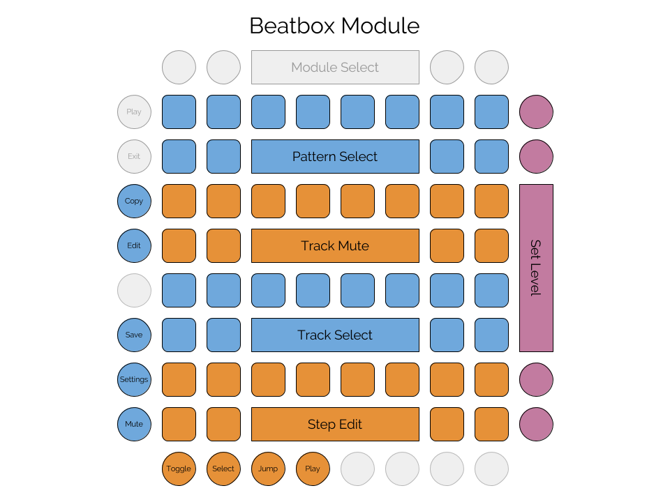

# Overview

Beat is a drum sequencer. 

Beat can hold 16 sessions in memory at a time. 
Each session contains 16 patterns.
Each pattern has 16 instrument tracks.
Each track consists of 16 steps. 
Each step can play a note (with settable velocity) or rest.
The entire contents of memory can be saved to a file. 
Within the Beat module, 16 different files can be saved and loaded, but
the files can be copied, backed up, and shared. Data is saved in a JSON format.


# Layout and Controls

## Main View



### Standard Controls

- Mute: disables the MIDI output of the sequencer.
- Settings: toggles between the main view and the settings view.
- Save: saves the current memory contents to the current file.

### Patterns

The first two rows of the grid in drum view are for selecting the playing patterns,
including selecting a range of patterns to be chained. To chain a set of patterns, hold down the first pattern in the
chain and then press the last pattern in the chain. Those patterns and all those in between will be played in order.
Whenever a pattern or chain of patterns is selected for play, the first pattern will be selected for editing, but another pattern can be edited by 
holding down the pattern edit button (along the left side) and tapping the pattern to edit.


### Tracks

Tracks occupy the 3rd, 4th, 5th, and 6th rows of the grid. The 3rd and 4th row are for muting and unmuting the available tracks. The 5th and 6th rows
select the track for editing using the step pads.

Each track corresponds to a single note value sent on a certain MIDI channel. The MIDI channel can be set in the Settings view.
The note numbers are arranged as a keyboard, with the white keys in row 6 and the black keys (and a few extras) in row 5. 
The note numbers for row 6 are: 36, 38, 40, 41, 43, 45, 47, and 48. The note numbers for row 5 are: 49, 37, 39, 51, 42, 44, 46, and 50. 
Beat has a configuration option to offset 
these note numbers by a certain amount; the offset is applied to all note values. For example, including `"midiNoteOffset": 24` in the
config file will move the whole drumkit up two octaves.


### Steps

Steps occupy the 7th and 8th rows of the grid. Step editing has five modes, selected by the edit mode pads: gate, velocity, pitch, and jump. 
In gate mode, tapping a step button toggles that step in the track between PLAY and REST, and selects it for velocity editing. 
If the ```tiesEnabled``` configuration option is set, then tapping a step cycles through PLAY, TIE, and REST. PLAY means that the
note will be played and any previous notes will be stopped. REST means that any previous notes will be stopped without a new note
being played. TIE means that any previous note will continue. Enabling TIE allows Beatbox to be used for triggering beat loops,
samples, notes, gated cymbals, etc.

In velocity mode, tapping a step 
selects it for velocity editing without changing the step's gate mode. When a step is selected, the value buttons will display the velocity, 
and pressing a button will set a new value. Eight velocity values are available, ranging from 15 to 127 in increments of 16.

In pitch mode, pitch bend settings can be edited for each step. Tapping a step will toggle between enabling and disabling pitch bend for that
step. When a step is tapped, its pitch bend value can be set with the value buttons. The middle two buttons correspond to normal pitch. 
If the receiving module has the pitch bend range set to 12 semitones, than the next button up will bend the pitch up one semitone. The
next button will be up two semitones, and then the highest button will bend an octave up. The buttons below middle send corresponding
pitches down. Beatbox will send pitch bend signals on its set MIDI channel for each enabled step. Pitch bend applies to the entire channel,
so is not programmable per track; think of each pattern as having a single pitch track.


Jump mode is more of a "performance" mode. In jump mode, tapping any of the step controls will play that step on the next clock tick,
advancing normally from there. The sequence will reset to the first step at the next reset. Tapping any of the track select controls
will play the corresponding sound rather than selecting the track. Also in jump mode, Beatbox will display a clock, where the current
step being played will be lit up, and a counter will keep track of the measure count up to 8. This is useful for knowing when
to trigger fills and watching what steps play during jumps and fills. Jump mode also allows "momentary pitch" control. Holding down
the value buttons will send a midi pitch bend value just as in pitch mode, but pitch bend will be reset to zero when you release
the button.


### Fill

The fill button can be used to play fills at any time. When the button is pressed, Beatbox will choose a random fill pattern and play it
as long as the button is held down. Beatbox's fill patterns aren't actually preset patterns; they're generated by rearranging the current
pattern in various ways to produce a fill. 


### Value buttons

These buttons can be used to select from a range of values; the purpose varies depending on the context. 
The eight buttons represent eight values in the relevant numeric range, with the lowest value at the bottom and highest value at the top. 
When a step is selected (by tapping it in either gate mode or velocity mode), the value buttons set the velocity of that step. After
selecting a fill pattern for editing, the value buttons set the fill probability.


## Settings View

Beat uses the standard [Settings Module](settings.md) for all settings.

# Configuration

Beat has a configuration option for the file prefix, used to specify filenames for saving data. 
Beat can also be set to use a blue, green, or pink color palette. Beat uses a default set of
midi notes for its various tracks, corresponding to standard MIDI drum mappings. The ```midiNoteOffset```
setting can be used to transpose all of the tracks by a number of semitones. For example, setting this
value to 24 will transpose all note numbers by two octaves. The ```tiesEnabled``` setting can be used
to allow notes longer than a single step to be played by Beatbox.

```
  "modules": [
    {
      "class": "BeatModule",
      "filePrefix": "beat0",
      "palette": "green",
      "midiNoteOffset": 24
    }
  ]
```

# Color Palette

Rhythm has three defined palettes: blue, green, and pink. Each uses yellow as a color, as well as white and gray.
- The pattern selection pads are in the main color (e.g. blue), with the currently playing pattern in white, other chained patterns in gray,
 and the pattern currently being edited in the highlight color (yellow). 
- Track mute pads are in gray, with muted tracks being off. Whenever a track plays a note, it will light in yellow.
- Track mute pads are in the main color (e.g. blue), with the selected track being white. Whenever a track plays a note, it will light in yellow.
- Step pads are white when that step is set to PLAY, gray for TIE, and off for REST.
- Function buttons on the left and bottom are gray when off, white when on.
- The value buttons show the value in the main color (e.g. blue).
- The settings view uses the standard settings palette.


  

