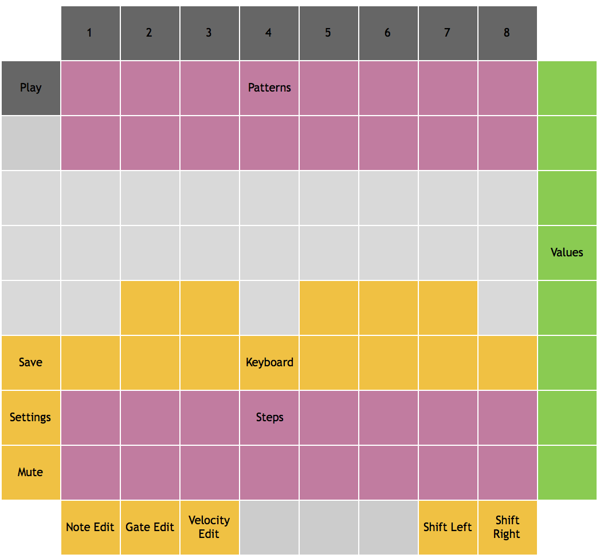
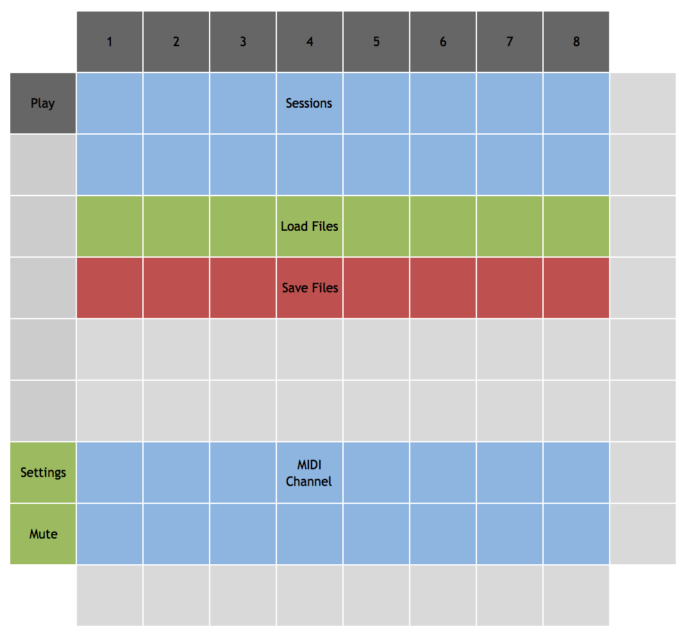

# Overview

Mono is a monophonic grid-based sequencer. 

Step can hold 16 sessions in memory at a time. 
Each session contains 16 patterns.
Each pattern consists of 16 steps. 
Each step can play a note (with settable velocity) or rest, or tie
the previous step.
The entire contents of memory can be saved to a file. 
Within the Mono module, 8 different files can be saved and loaded, but
the files can be copied, backed up, and shared. Data is saved in a JSON format.


# Layout and Controls

## Main View



### Standard Controls

- Mute: disables the MIDI output of the sequencer.
- Settings: toggles between the main view and the settings view.
- Save: saves the current memory contents to the current file.

### Patterns

Each session contains 16 patterns, which are selected using the pattern pads.
Tapping a pattern pad will switch to that pattern on the next measure. 
Multiple patterns can be chained by holding down the first pattern's pad
and then tapping the last pattern's pad. 

#### Copy and Clear

Just below the pattern pads, these controls can be used to clear a pattern or copy a pattern to
another pattern slot. For copy, hold down the copy button, tap the pattern to copy, and then
the desired destinaton. For clear, hold down the clear button and tap the pattern to clear.

### Keyboard

These pads form a simple one-octave keyboard, starting from C on the left. These keys can used
to select the note for the currently selected step. 

### Steps

Each pattern has 16 steps. The step controls (and other controls) have different functions depending
on the current step edit mode, which is set via the bottom row of buttons. In **note edit mode**,
tapping a step selects it for editing; the keyboard will display the selected step's note, 
while the value buttons will display its octave.
Tap the keyboard or octave buttons to change the values for the step. 
In **gate edit mode**, tapping a step cycles through the three gate modes: play, tie, and off. In
play mode, the step's note will be played. In tie mode, the previous step will be sustained. In
off mode, a rest will be played. 
In **velocity edit mode**, tap a step to set its velocity using the value buttons on the right.

#### Step Edit Modes

The step edit mode can be set via the leftmost three buttons on the bottom row. The selected
mode will be lit.

### Value Buttons

These buttons can be used to select from a range of values; the purpose varies depending
on the context. When editing a step in note edit mode, the value buttons select the octave 
of the note. In velocity edit mode, they select the velocity (volume) of the note to be played. 

### Shift Controls

Tap shift left to shift all the steps to the left, with the first step becoming the last. Tap
shift right to shift the steps to the right.

## Settings View



### Sessions

Tap a session pad to select that session from memory. The current session is lit.

### Files

Tap a load pad to load the file with the corresponding number. For example,
if Step is configured to use "step" as a file prefix, pressing the first
pad will load "step-0.json" into memory. Similarly, tap a save pad to save 
the current memory to the corresponding file. The previous file will be moved
to a backup (but only the most recent backup will be retained). The most recently
saved or loaded file will be lit; this is the file that will be written when
tapping the save button in the main view.

### MIDI Channel

These 16 pads correspond to the 16 MIDI channels. Tap one to send the sequencer's
notes on that channel.


# Configuration

Mono has a configuration option for the file prefix, used
to specify filenames for saving data. Mono can also be
set to use a fuchsia or orange color palette.

```
  "modules": [
    {
      "class": "MonoModule",
      "filePrefix": "mono",
      "palette": "orange"
    }
  ]
```

# Color Palette

Mono has two defined palettes: fuchsia and orange. This section describes the color values in the fuchsia palette.

- On most controls, dark blue indicates off/inactive, and orange indicates on/active.
- Sessions are light blue, with the current session highlighted white.
- Load and save files are green and red respectively, with the current file white.
- MIDI channel is blue, with the selected channel white.
