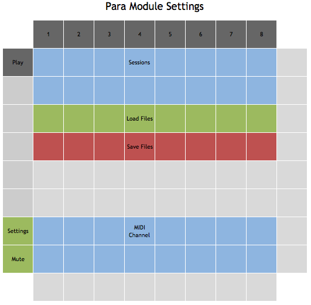

# Overview

Para is a paraphonic grid-based sequencer. 
What is a "paraphonic" sequencer? 
A paraphonic synthesizer is one that has multiple oscillators but only one filter-amp path, meaning
that, though it can play chords. it can't play fully separated, individually articulated notes at the same time.
Similarly, this paraphonic sequencer allows multiple notes to be sequenced on each step, but they cannot
be completely controlled separately. Instead, it is programmed much like a monophonic sequencer; each
active step ends all the previously-played notes. A step can be a "tie", which means it will continue
notes played by a previous step. In essence, Para can play chords at each step, but cannot, for example,
sustain one note while a sequence of other notes play beneath it. This makes for a simplified 
interface that allows for easy creation of chord sequences.


Para can hold 16 sessions in memory at a time. 
Each session contains 16 patterns.
Each pattern consists of 16 steps. 
Each step can play multiple notes (with a single settable velocity), 
can tie the previous step, or can play  rest.
The entire contents of memory can be saved to a file. 
Within the Para module, 8 different files can be saved and loaded, but
the files can be copied, backed up, and shared. Data is saved in a JSON format.


# Layout and Controls

## Main View


### Standard Controls

- Mute: disables the MIDI output of the sequencer.
- Settings: toggles between the main view and the settings view.
- Save: saves the current memory contents to the current file.

### Patterns

Each session contains 16 patterns, which are selected using the pattern pads.
Tapping a pattern pad will switch to that pattern on the next measure. 
Multiple patterns can be chained by holding down the first pattern's pad
and then tapping the last pattern's pad. 

#### Copy and Clear

On the left side above Save, these controls can be used to clear a pattern or copy a pattern to
another pattern slot. For copy, hold down the copy button, tap the pattern to copy, and then
the desired destinaton. For clear, hold down the clear button and tap the pattern to clear.

### Keyboard

These pads form a simple two-octave keyboard, starting from C on the left. These keys can be used
to select the notes for the currently selected step. 
The octave up and down buttons will change the octaves being played by the keyboard.
During playback, the notes being played will briefly flash. If the notes are above or below
the current keyboard range, the appropriate octave button will flash.

### Steps

Each pattern has 16 steps. A step can be selected for editing by tapping it. The keyboard
can then be used to toggle whether each note is played on that step. Holding down the 
step pad will cause the step's notes to be highlighted on the keyboard; if the notes
are out of range of the keyboard, the octave up or down pads will be highlighted. The
step pad doesn't have to be held down to edit the notes; it's just to display the selected
notes on the keyboard.
Note that if Para is in monophonic mode, hitting any key will toggle off any other key that was on. 

#### Step Edit Modes

The left two buttons on the bottom row choose either toggle mode or select mode for step
pads. In toggle mode, tapping a step pad will toggle it from enabled to disabled or vice
versa. In select mode, tapping a step pad will not change its enabled state. In either
case, tapping the step pad will select it for editing. 

#### Step Gate Modes

A step can be set to PLAY or TIE by tapping the corresponding control along the bottom.
When set to PLAY, the step will play the programmed notes.
In TIE, it will simply hold any previously-played notes but will not play its own. Note
that a REST can be created by disabling the step, or by setting it to PLAY with no
notes selected.

#### Transpose Controls

Next to the upper octave of the keyboard are the transpose up and transpose down controls.
These will transpose all notes on the current step up or down an octave. Note that these
change the selected notes, while the octave up and down controls change the visible range
of the keyboard.

### Value Buttons

(not implemented)

## Settings View



### Sessions

Tap a session pad to select that session from memory. The current session is lit.

### Files

Tap a load pad to load the file with the corresponding number. For example,
if Para is configured to use "para" as a file prefix, pressing the first
pad will load "para-0.json" into memory. Similarly, tap a save pad to save 
the current memory to the corresponding file. The previous file will be moved
to a backup (but only the most recent backup will be retained). The most recently
saved or loaded file will be lit; this is the file that will be written when
tapping the save button in the main view.

### MIDI Channel

These 16 pads correspond to the 16 MIDI channels. Tap one to send the sequencer's
notes on that channel.


# Configuration

Para has a configuration option for the file prefix, used
to specify filenames for saving data. Mono can also be
set to use a yellow, orange, blue, or pink color palette.
Finally monophonic can be set to true or false; when true, it will allow only one note
to be set on each pattern step (though it will not automatically alter previously-saved sequences
with multiple notes).


```
  "modules": [
    {
      "class": "ParaModule",
      "filePrefix": "para0",
      "palette": "orange",
      "monophonic": false
    }
  ]
```

## Keyboard and Chords

If Hachi is configured with a MIDI keyboard (see [the main Hachi manual](../hachi.md)), ParaModule will respond to 
chords by filtering output MIDI notes to the closest Chord note.

# Color Palette

Para has four defined palettes: yellow, orange, blue, and pink. This section describes the color values in the default yellow palette.

- On most controls, dark gray indicates off/inactive, and bright yellow indicates on/active.
- Patterns are shown in dim yellow, with the playing pattern white and chained patterns gray.
- Disabled steps are off. Enabled PLAY steps are bright yellow, TIE steps dim yellow. The current step will flash white.
- The PLAY and TIE controls are respectively bright yellow and dim yellow.
- They keyboard is gray. Playing notes will flash yellow, as will the octave indicators. While editing a step, the step
notes will be blue.
- The octave up and down controls are white; the transpose up and down controls are dim yellow.
- Sessions are light blue, with the current session highlighted white.
- Load and save files are green and red respectively, with the current file white.
- MIDI channel is blue, with the selected channel white.
