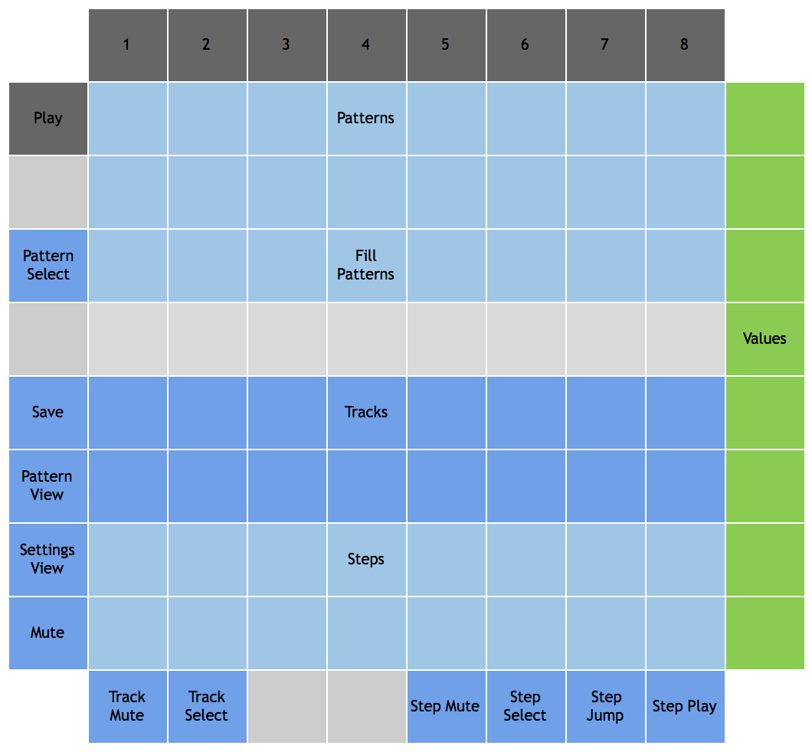
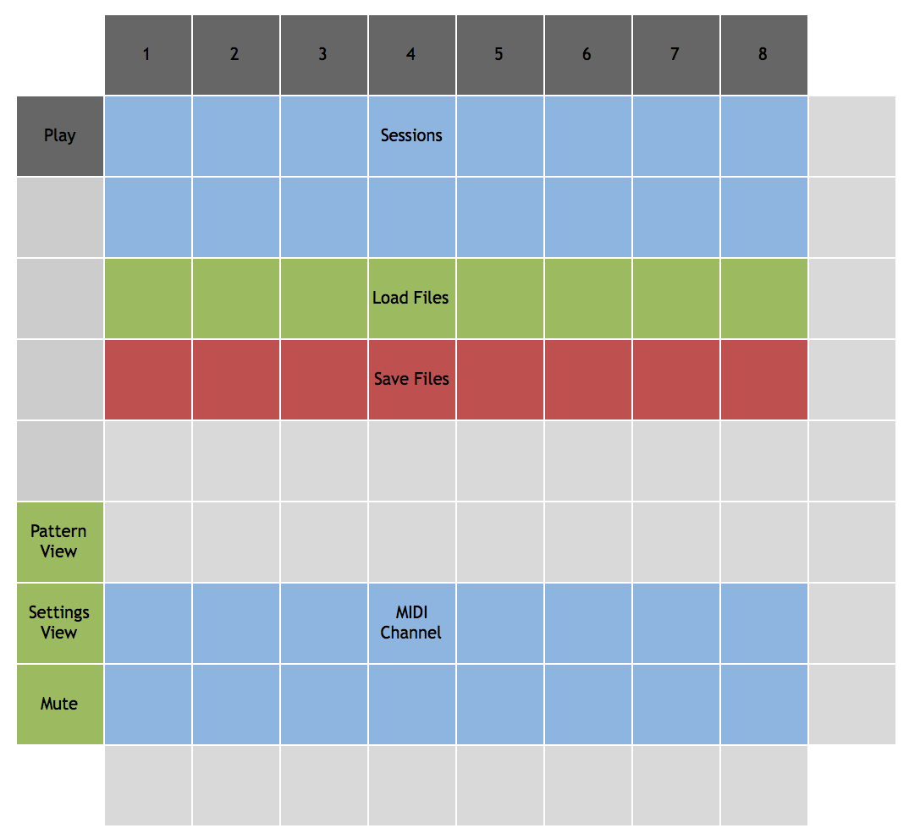

# Overview

Rhythm is a drum sequencer. 

Rhythm can hold 16 sessions in memory at a time. 
Each session contains 16 base patterns and 8 fill patterns.
Each pattern has 16 instrument tracks.
Each track consists of 16 steps. 
Each step can play a note (with settable velocity) or rest.
The entire contents of memory can be saved to a file. 
Within the Mono module, 8 different files can be saved and loaded, but
the files can be copied, backed up, and shared. Data is saved in a JSON format.


# Layout and Controls

## Main View



### Standard Controls

- Mute: disables the MIDI output of the sequencer.
- Settings view: selects the settings view.
- Pattern view: selects the main pattern view.
- Save: saves the current memory contents to the current file.

### Patterns

Patterns occupy the first three rows of the grid in drum view. The top two rows are base patterns, and the third row are fills. 

#### Base patterns

To select a base pattern, simply tap it. If Hachi is playing, the pattern will begin when the current measure finishes. To select a chain of patterns, hold down the first and last pattern at the same time. In both cases, the new pattern won't be selected until you release the pads (unlike with most other functions). When multiple patterns are chained, they will cycle in order. Whatever pattern is currently playing will be selected for editing with the track and step pads. To fix editing to a single pattern, tap the pattern pad while holding down the `pattern select` button. Whenever a new pattern or pattern chain is selected for playing, editing will default back to the playing pattern.

#### Fills

Each fill pattern has a fill interval; when enabled, the pattern will play every time that many measures play. For example, if the pattern's interval is four, the fill pattern will play every fourth measure. Note that fills will replace chained base patterns; if a 4-pattern chain is selected and a fill with an interval of 4 is enabled, the fourth measure of the chain will always be replaced by the fill. The eight fill patterns currently have fixed intervals; from the left, their intervals are 2, 2, 4, 4, 8, 8, 16, 16. 

If two fills with the same interval are enabled, Sequence will randomly choose between them when their interval comes up. If two fills with different intervals come up at the same time, the one with the longer interval will be chosen. For example, if we select a chain of four base patterns B1, B2, B3, and B4 and enable three fill patterns F1, F2, and F3 with intervals of 4, 8, and 16 respectively, the pattern play order will be: B1, B2, B3, F1, B1, B2, B3, F2, B1, B2, B3, F1, B1, B2, B3, F3. Note that B4 never gets played. Sequence counts measures from when it was last started and uses those counts to determine when to play the fills; selecting new base patterns will not change when the fills will play.

Fills can also have a play probability. When the probability is less than 1, the original base pattern will sometimes play instead. If F1 has a probability of 0.5 in the above example, F1 and B4 would be played in that slot about equally. 

Fills can be enabled/disabled by tapping their pads. To edit a fill, hold down the pattern select button and tap the fill pad. After selecting a fill for editing, the value keys can be used to set the fill probability. 

### Tracks

Tracks occupy the 5th and 6th rows of the grid. Track editing has two modes, selected by the `track mute` and `track select` mode pads. In mute mode, tapping a track pad toggles its mute/unmute mode without selecting it for editing. In select mode, tapping a track pad selects it for editing and displays the track's steps on the step pads. 

Each track corresponds to a single note value sent on a certain MIDI channel. At present, the channel for all tracks is hard-coded to 10. The note numbers are arranged as a keyboard, with the white keys in row 6 and the black keys (and a few extras) in row 5. The note numbers for row 6 are: 36, 38, 40, 41, 43, 45, 47, and 48. The note numbers for row 5 are: 49, 37, 39, 51, 42, 44, 46, and 50. Rhythm has a configuration option to offset 
these note numbers by a certain amount; the offset is applied to all note values. For example, including `"midiNoteOffset": 24` in the
config file will move the whole drumkit up two octaves.

### Steps

Steps occupy the 7th and 8th rows of the grid. Step editing has four modes, selected by the step mode pads: mute, velocity, jump, and play. In mute mode, tapping a step button toggles that step in the track and selects it for velocity editing. In velocity mode, tapping a step selects it for velocity editing without toggling the step's mute state. When a step is selected, the value buttons will display the velocity, and pressing a button will set a new value. Eight velocity values are available, ranging from 15 to 127 in increments of 16.

In jump mode, the sequencer will play that step on its next clock tick, advancing normally from there. The sequence will reset to the first step at the next reset. In play mode, the corresponding sound will be played immediately (not quantized). 


### Value buttons

These buttons can be used to select from a range of values; the purpose varies depending on the context. 
The eight buttons represent eight values in the relevant numeric range, with the lowest value at the bottom and highest value at the top. 
When a step is selected (by tapping it in either mute mode or velocity mode), the value buttons set the velocity of that step. After
selecting a fill pattern for editing, the value buttons set the fill probability.


## Settings View



### Sessions

Tap a session pad to select that session from memory. The current session is lit.

### Files

Tap a load pad to load the file with the corresponding number. For example,
if Rhythm is configured to use "rhythm" as a file prefix, pressing the first
pad will load "rhythm-0.json" into memory. Similarly, tap a save pad to save 
the current memory to the corresponding file. The previous file will be moved
to a backup (but only the most recent backup will be retained). The most recently
saved or loaded file will be lit; this is the file that will be written when
tapping the save button in the main view.

### MIDI Channel

These 16 pads correspond to the 16 MIDI channels. Tap one to send the sequencer's
notes on that channel.


# Configuration

Rhythm has a configuration option for the file prefix, used to specify filenames for saving data. 
Rhythm can also be set to use a blue or red color palette.

```
  "modules": [
    {
      "class": "RhythmModule",
      "filePrefix": "rhythm",
      "palette": "red",
      "midiNoteOffset": 24
    }
  ]
```

# Color Palette

Rhythm has two defined palettes: blue and red. This section describes the color values in the blue palette.

- On most controls, dark blue indicates off/inactive, and light blue indicates on/active.
- Sessions are light blue, with the current session highlighted white.
- Load and save files are green and red respectively, with the current file white.
- MIDI channel is blue, with the selected channel white.
- Patterns are dim blue, with the currently selected pattern white. Other chained patterns are gray. The currently playing
pattern is dim green, bright green if it's also selected for editing.
- Tracks are gray, with the currently selected track white. When a note is played on a track, it will flash green. 
Muted tracks are off, and notes will flash dim green while the track is muted. 
If the currently selected track is muted, it will be highlighted in a medium gray.
- Steps are off, and gray if the step is enabled. When a step plays, it will flash green.

