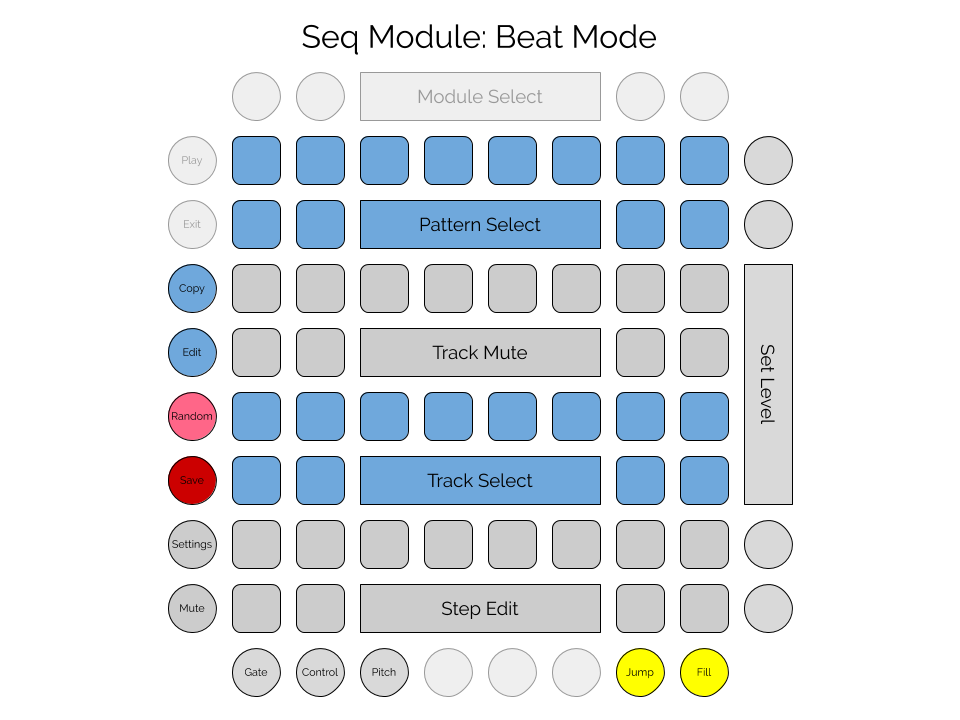
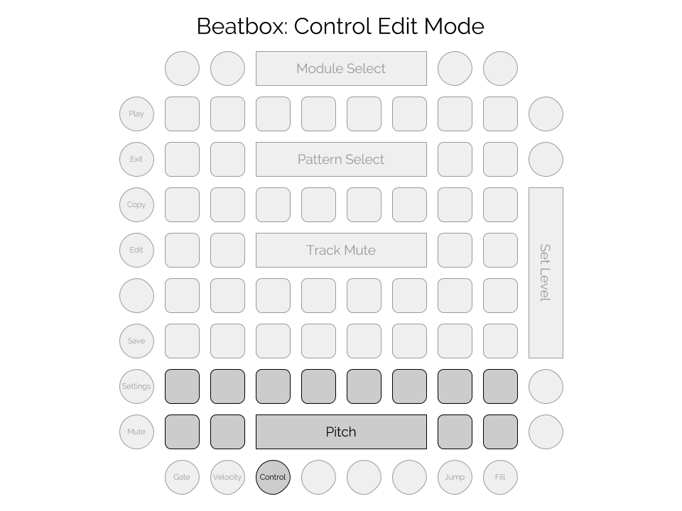
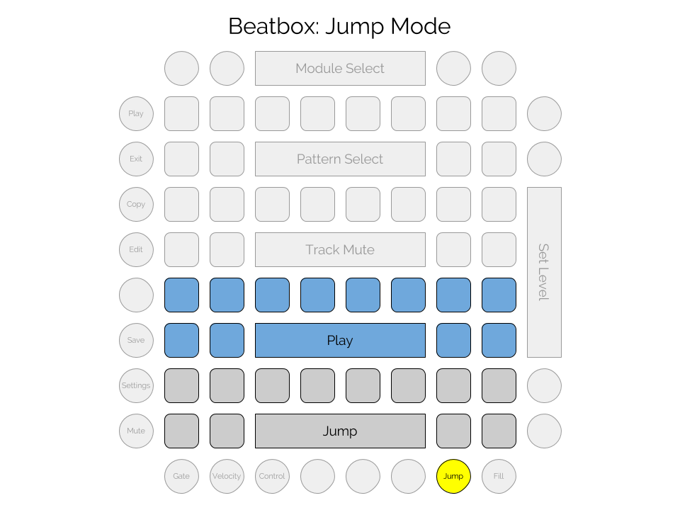
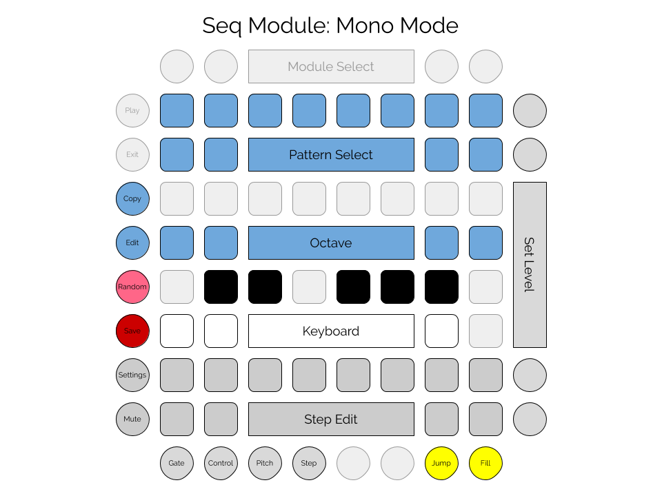

# Overview

Seq is a multi-purpose sequencer. It can run as a drum sequencer ("beat" mode)
and a monophonic sequencer ("mono" mode)
and will eventually support a polyphonic sequencer mode. 

Features:
- Seq can hold 16 sessions in memory at a time. 
- Each session contains 16 patterns.
- In Beat mode, each pattern contains 16 tracks, with a MIDI note defined for each track.
- In Mono mode, each pattern contains one track, which can play a monophonic sequence of notes. 
- Each track consists of 16 steps. 
- Each step can play a note (with settable velocity) or rest.
- Seq also supports 16 control tracks per pattern, which can send MIDI CC values on each step.
- The entire contents of memory can be saved to a file. 
- Within the Seq module, 16 different files can be saved and loaded, but
the files can be copied, backed up, and shared. Data is saved in a JSON format.

# Layout and Controls

## Controls common to both Beat and Mono modes

### Buttons
- Mute: disables the MIDI output of the sequencer.
- Settings: toggles between the main view and the settings view.
- Save: saves the current memory contents to the current file.
- Copy: for copying patterns.
- Edit: for selecting a pattern to edit other than the currently running pattern.
- Edit view buttons: select gate, control, or pitch.
- Jump view: selects the jump view rather than one of the edit views.
- Fill: plays fill patterns while held down.  

### Pattern Select
The first two rows of the grid are for selecting the playing patterns, including selecting a range of patterns to be 
chained. To select a single pattern, tap the pad; the pattern will begin at the start of the next measure. 
To chain a set of patterns, hold down the first pattern in the chain and then press the last pattern in the chain. 
Those patterns and all those in between will be played in order, beginning at the start of the next measure.
Whenever a pattern or chain of patterns is selected for play, the first pattern will be selected for editing, but another pattern can be edited by 
holding down the pattern edit button (along the left side) and tapping the pattern to edit. Pattern selection
is available in all editing views.

### Value Buttons

These buttons can be used to select from a range of values. In the main editing view, the value buttons are used to
edit the velocity value for each step. In control edit view, they are used to set the value for the controller at
each step. The eight value buttons represent eight values in the relevant numeric range,  
with the lowest value at the bottom and highest value at the top; tap a button 
to set the velocity to that value. For in-between values, press and hold a button to set the value, and then tap 
a button below or above the held button to decrease or increase the value. Tapping a button right next to the held button
will change the value by 1; tapping a button farther away will change the value by 5.   

## Beat mode

Beat mode provides a drum-machine style interface for programming 16 drum trigger tracks, which can 
be used to trigger one-shot drum sounds or samples, as well as sustained loops or other sounds.



### Views

- Gate view: for editing individual drum tracks, used to sequence drum triggers on each track and set velocity. 
- Control view: for editing the 16 controller tracks. 
each pattern also includes 16 MIDI controller tracks, which can be edited in the control view.
- Pitch view: similar to the control view, but specifically for MIDI pitch bend.
- Jump view: a performance view allowing direct playing of drum sounds and realtime manipulation of pattern playback.
- Fill: plays a randomly-selected, algorithmically-computed fill pattern while held down.   

### Gate view

In the gate view,
**tracks** occupy the 3rd, 4th, 5th, and 6th rows of the grid. The 3rd and 4th row are for muting and unmuting the 
16 available tracks. The 5th and 6th rows select the track for editing using the step pads. 

Each track corresponds to a single note value sent on a certain MIDI channel. 
The MIDI channel can be set in the Settings view. The note numbers are arranged as a keyboard, with the white keys in 
row 6 and the black keys (and a few extras) in row 5. The note numbers for row 6 are: 36, 38, 40, 41, 43, 45, 47, and 48. 
The note numbers for row 5 are: 49, 37, 39, 51, 42, 44, 46, and 50. 
Beat has a configuration option to offset these note numbers by a certain amount; the offset is applied to all note values. 
For example, including `"midiNoteOffset": 24` in the config file will move the whole drumkit up two octaves.

**Steps** occupy the 7th and 8th rows of the grid. The 16 step buttons correspond to the 16th note steps of
a full measure. In the gate view, each step can be turned on or off, and its velocity can be set.  
Tapping a step pad toggles that step in the track between PLAY and REST, and selects it for velocity editing. 
If the `tiesEnabled` configuration option is set, then tapping a step cycles through PLAY, TIE, and REST. PLAY means that the
note will be played and any previous notes will be stopped. REST means that any previous notes will be stopped without a new note
being played. TIE means that any previous note will continue. Enabling TIE allows Seq to be used for triggering beat loops,
samples, notes, gated cymbals, etc. Tapping a step pad also selects it so that the velocity can be editing with the value buttons.
To select a step for editing without toggling, press and hold for half a second. 

### Control view



In the control view, the **track** select and track mute pads work the same as in gate view, 
but are for selecting and muting the 16 control tracks. The tracks correspond to 16 MIDI 
continuous controllers, which can be set via
the `controllerNumbers` configuration option. For example, including 
`"controllerNumbers": [ 21, 25, 20, 24, 74, 71, 102, 105, 29, 30, 27, 28, 103, 113, 114, 111 ]`
in the config file will assign those controllers to the 16 tracks.

Similarly, the **step** pads work the same as in the gate view,
except that the value buttons are used to edit the transmitted controller
value rather than the note velocity. The control view also has no TIE option.

### Pitch view

The pitch view is similar to the control view, except that it is used for sending MIDI pitch bend control and there is only
one track. The track select and track mute pads don't do anything, but the first pad lights up as a reminder that 
there is a single pitch track. 

When a step is tapped, its pitch bend value can be set with the value buttons. The middle two buttons correspond to 
normal pitch. The value buttons are set to special fixed values in the pitch view, such that 
if the receiving module has the pitch bend range set to 12 semitones, 
then the next button up will bend the pitch up one semitone. The
next button will be up two semitones, and then the highest button will bend an octave up. 
The buttons below middle send corresponding
pitches down. Seq will send pitch bend signals on its set MIDI channel for each enabled step. 

### Jump view



In the jump view, the track select pads can be used to play the corresponding 16 drum sounds directly. Tap a pad
to play the sound, at the velocity with which you play the pad. Tapping any of the step controls will play that step on the next clock tick,
advancing normally from there. The sequence will reset to the first step at the next reset. Jump view also allows "momentary pitch" control. Holding down
the value buttons will send a midi pitch bend value just as in pitch view, but pitch bend will be reset to zero when you release
the button.

### Fill

The fill button can be used to play fills at any time. When the button is pressed, Seq will choose a random fill pattern and play it
as long as the button is held down. Seq's fill patterns aren't actually preset patterns; they're generated by rearranging the current
pattern in various ways to produce a fill. 

## Mono mode

Mono mode provides a monophonic melodic sequencer for programming melodies across a range of 8 octaves.



### Views

Mono mode offers the same five views as beat mode: gate, control, pitch, jump, and fill. 
This section describes the ways mono mode differs from beat mode.

### Gate view

Mono offers only a single note track, so there is no need for the track select and mute pads.
Instead, gate view provides a one-octave note keyboard in rows 5 and 6,
octave controls in row 4, 
and (future addition) a set of step modifiers in row 3.

When a step is selected, its semitone can be selected on the keyboard, and its octave set via the octave pads.
Every step has a semitone and octave setting, even if the step is disabled. As in Beat mode,
steps can be set to PLAY, REST, or TIE by tapping the step pad, and the velocity can be set with the value pads.
To select a step without changing the play setting, press and hold for half a second. 
 
### Other views

The control, pitch, jump, and fill views function the same in Mono mode as they do in Beat mode.

## Settings View

Beat uses the standard [Settings Module](settings.md) for all settings.

# Configuration

Seq has a configuration option for the file prefix, used to specify filenames for saving data. 
Seq can also be set to use a blue, green, or pink color palette. Beat uses a default set of
midi notes for its various tracks, corresponding to standard MIDI drum mappings. The ```midiNoteOffset```
setting can be used to transpose all of the tracks by a number of semitones. For example, setting this
value to 24 will transpose all note numbers by two octaves. The ```tiesEnabled``` setting can be used
to allow notes longer than a single step to be played by Seq. The ```sessionPrograms``` setting
can be used to set midi program change values for each session. When the session is loaded, a program change 
message will be sent with the provided value; a missing value or value of ```-1``` will result in no 
message being sent.

```
  "modules": [
    {
      "class": "SeqModule",
      "filePrefix": "seq0",
      "palette": "green",
      "midiNoteOffset": 24,
      "tiesEnabled": false,
      "controllerNumbers": [ 16, 17, 18, 19, 20, 21, 22, 23, 81, 82, 83, 84, 85, 86, 87, 88 ],
      "sessionPrograms": [ 16, 17, 8, 13]
    }
  ]
```

# Color Palette

Rhythm has nine defined palettes: pink, blue, green, red, orange, purple, magenta, teal, yellow. Each uses white and gray, with yellow
as a highlight color (accept for the yellow palette, which uses purple for highlight). 
- The pattern selection pads are in the main color (e.g. blue), with the currently playing pattern in white, other chained patterns in gray,
 and the pattern currently being edited in the highlight color. 
- Track mute pads are in gray, with muted tracks being off. Whenever a track plays a note, it will light in the highlight color.
- Track select pads are in the main color (e.g. blue), with the selected track being white. Whenever a track plays a note, it will light in the highlight color.
- The keyboard in Mono mode is in light and dark gray, for the white and black keys. The current step's programmed semitone will be shown
in the highlight color, and keys will flash in the main color when played. 
- Octave keys are in the main color, with the current step's programmed octave in the highlight color. The octave of the currently playing note will be indicated in white.
- Step pads are white when that step is set to PLAY, gray for TIE, and off for REST.
- Function buttons on the left and bottom are gray when off, white when on.
- The value buttons show the value in the main color (e.g. blue).
- The settings view uses the standard settings palette.


  

