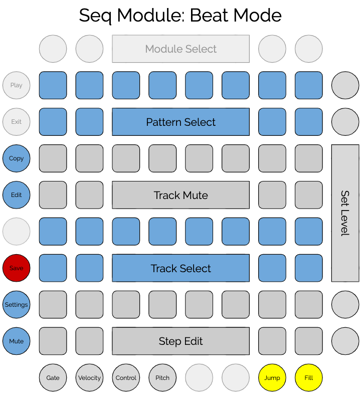

# Overview

Seq is a multi-purpose sequencer. It can run as a drum sequencer ("beat mode")
and will eventually support mono and polyphonic sequencer modes. 

Seq can hold 16 sessions in memory at a time. 
Each session contains 16 patterns.
Each pattern has 16 instrument tracks.
Each track consists of 16 steps. 
Each step can play a note (with settable velocity) or rest.
Seq also supports 16 control tracks per pattern, which can send
MIDI CC values on each step.
The entire contents of memory can be saved to a file. 
Within the Seq module, 16 different files can be saved and loaded, but
the files can be copied, backed up, and shared. Data is saved in a JSON format.

This manual describes how to use Seq for beat mode; other modes will differ.

# Layout and Controls

## Common Controls

These controls are the same in all modes.

- Mute: disables the MIDI output of the sequencer.
- Settings: toggles between the main view and the settings view.
- Save: saves the current memory contents to the current file.
- Copy: for copying patterns.
- Edit: for selecting a pattern to edit other than the currently running pattern.
- Edit mode buttons: select gate, velocity, control, or pitch.
- Jump mode: selects jump mode rather than one of the edit modes.
- Fill: plays fill patterns while held down.  

## Modes of operation

- Beat mode: Seq can function as a 16-track drum sequencer. In this mode, the main controls allow the selection
and muting of tracks, along with the editing of each step for each drum sound.
- Gate and velocity modes: modes for editing individual drum tracks. Gate allows easy toggling of on/off at each
step, while velocity mode makes it easier to quickly edit the per-step velocity.
- Control mode: each pattern also includes 16 MIDI controller tracks, which can be edited in control mode.
- Pitch mode: similar to control mode, but specifically for MIDI pitch bend.
- Jump mode: a performance mode allowing direct playing of drum sounds and realtime manipulation of pattern playback.
- Fill: plays a randomly-selected, algorithmically-computed fill pattern while held down.   

## Beat Mode Editing

In beat mode, Seq functions as a 16-track rhythm sequencer. Each track controls a single drum sound,
corresponding to a specific MIDI note on the main Seq MIDI channel. 



### Patterns

The first two rows of the grid in drum view are for selecting the playing patterns,
including selecting a range of patterns to be chained. To chain a set of patterns, hold down the first pattern in the
chain and then press the last pattern in the chain. Those patterns and all those in between will be played in order.
Whenever a pattern or chain of patterns is selected for play, the first pattern will be selected for editing, but another pattern can be edited by 
holding down the pattern edit button (along the left side) and tapping the pattern to edit. Pattern selection
is available in all editing modes.

### Tracks

Tracks occupy the 3rd, 4th, 5th, and 6th rows of the grid. The 3rd and 4th row are for muting and unmuting the available tracks. The 5th and 6th rows
select the track for editing using the step pads. Rows 3 and 4 are used for track muting in all edit modes; rows 5 and 6 have different
roles in different modes.

Each track corresponds to a single note value sent on a certain MIDI channel. 
The MIDI channel can be set in the Settings view. The note numbers are arranged as a keyboard, with the white keys in 
row 6 and the black keys (and a few extras) in row 5. The note numbers for row 6 are: 36, 38, 40, 41, 43, 45, 47, and 48. 
The note numbers for row 5 are: 49, 37, 39, 51, 42, 44, 46, and 50. 
Beat has a configuration option to offset these note numbers by a certain amount; the offset is applied to all note values. 
For example, including `"midiNoteOffset": 24` in the config file will move the whole drumkit up two octaves.

### Steps

Steps occupy the 7th and 8th rows of the grid. The 16 step buttons correspond to the 16th note steps of
a full measure. For each track, each step can be turned on or off, and its velocity can be set.  
In gate mode, tapping a step button toggles that step in the track between PLAY and REST, and selects it for velocity editing. 
If the `tiesEnabled` configuration option is set, then tapping a step cycles through PLAY, TIE, and REST. PLAY means that the
note will be played and any previous notes will be stopped. REST means that any previous notes will be stopped without a new note
being played. TIE means that any previous note will continue. Enabling TIE allows Seq to be used for triggering beat loops,
samples, notes, gated cymbals, etc.

In velocity mode, tapping a step selects it for velocity editing without changing the step's gate mode. 
When a step is selected in either gate or velocity mode, the value buttons will display the velocity, 
and pressing a button will set a new value. Eight velocity values are available, ranging from 15 to 127 in increments of 16.

### Value Buttons and the Value Control

These buttons can be used to select from a range of values. In the main editing mode, the value buttons are used to
edit the velocity value for each step.
The eight value buttons represent eight values in the relevant numeric range, with the lowest value at the bottom and highest value at the top.

## Control Mode


Each pattern includes 16 MIDI controller tracks. the MIDI CC numbers are set via the `controllerNumbers` 
setting in the config file. The 16 track select pads can be used to select a control track for editing. 
In each control track, each step can be enabled and a value can be set using the value buttons.
Tap a pad to toggle that step and select it for editing. To edit a step without toggling it, press and hold the pad for
half a second. 

## Pitch Mode

Pitch mode is similar to control mode, except that it is used for sending MIDI pitch bend control and there is only
one track. The track select pads don't do anything, but the first pad lights up as a reminder that there is a single
pitch track. 

When a step is tapped, its pitch bend value can be set with the value buttons. The middle two buttons correspond to normal pitch. 
If the receiving module has the pitch bend range set to 12 semitones, than the next button up will bend the pitch up one semitone. The
next button will be up two semitones, and then the highest button will bend an octave up. The buttons below middle send corresponding
pitches down. Seq will send pitch bend signals on its set MIDI channel for each enabled step. 

## Jump Mode


In jump mode, the track select pads can be used to play the corresponding 16 drum sounds directly. Tap a pad
to play the sound, at the velocity with which you play the pad. Tapping any of the step controls will play that step on the next clock tick,
advancing normally from there. The sequence will reset to the first step at the next reset. Jump mode also allows "momentary pitch" control. Holding down
the value buttons will send a midi pitch bend value just as in pitch mode, but pitch bend will be reset to zero when you release
the button.

## Fill

The fill button can be used to play fills at any time. When the button is pressed, Seq will choose a random fill pattern and play it
as long as the button is held down. Seq's fill patterns aren't actually preset patterns; they're generated by rearranging the current
pattern in various ways to produce a fill. 

## Settings View

Beat uses the standard [Settings Module](settings.md) for all settings.

# Configuration

Seq has a configuration option for the file prefix, used to specify filenames for saving data. 
Seq can also be set to use a blue, green, or pink color palette. Beat uses a default set of
midi notes for its various tracks, corresponding to standard MIDI drum mappings. The ```midiNoteOffset```
setting can be used to transpose all of the tracks by a number of semitones. For example, setting this
value to 24 will transpose all note numbers by two octaves. The ```tiesEnabled``` setting can be used
to allow notes longer than a single step to be played by Seq. The ```sessionPrograms``` setting
can be used to set midi program change values for each session. When the session is loaded, a program change 
message will be sent with the provided value; a missing value or value of ```-1``` will result in no 
message being sent.

```
  "modules": [
    {
      "class": "SeqModule",
      "filePrefix": "seq0",
      "palette": "green",
      "midiNoteOffset": 24,
      "tiesEnabled": false,
      "controllerNumbers": [ 16, 17, 18, 19, 20, 21, 22, 23, 81, 82, 83, 84, 85, 86, 87, 88 ],
      "sessionPrograms": [ 16, 17, 8, 13]
    }
  ]
```

# Color Palette

Rhythm has five defined palettes: pink, blue, green, red, and orange. Each uses yellow as a color, as well as white and gray.
- The pattern selection pads are in the main color (e.g. blue), with the currently playing pattern in white, other chained patterns in gray,
 and the pattern currently being edited in the highlight color (yellow). 
- Track mute pads are in gray, with muted tracks being off. Whenever a track plays a note, it will light in yellow.
- Track mute pads are in the main color (e.g. blue), with the selected track being white. Whenever a track plays a note, it will light in yellow.
- Step pads are white when that step is set to PLAY, gray for TIE, and off for REST.
- Function buttons on the left and bottom are gray when off, white when on.
- The value buttons show the value in the main color (e.g. blue).
- The settings view uses the standard settings palette.


  

