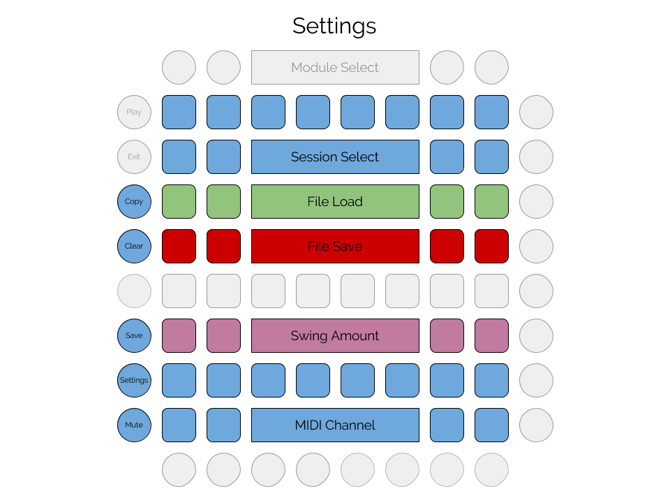

# Overview

Many modules share the same settings view, for setting standard options for the module. 
In most modules, a particular button (usually the 2nd button from the bottom on the left)
will toggle between the main view and the settings view. 

## Settings View

<!---->

### Sessions

Tap a session pad to select that session from memory. The current session is lit. 
The next session will usually load at the start of the next measure; the next session will be highlighted in gray.

#### Session Copy

The session copy button can be used to copy a session within the current memory, or from the current 
memory into a file. To copy from one session to another, press and hold "copy", tap the session 
to be copied from, tap the session to be copied to, and then release "copy". To copy a session to
another file, press and hold "copy", tap the session to be copied from, tap the file save pad for
the file to be copied to, tap the session to be copied to, and then release "copy". 
  
#### Session Clear

The session clear button can be used to clear a session in current memory. To clear a session,
press and hold "clear", tap the session to be cleared, and then release "clear".

### Files

Tap a load pad to load the file with the corresponding number. For example,
if a Beatbox module is configured to use "beat" as a file prefix, pressing the first
pad will load "beat-0.json" into memory. Similarly, tap a save pad to save 
the current memory to the corresponding file. The previous file will be moved
to a backup (but only the most recent backup will be retained). The most recently
saved or loaded file will be lit; this is the file that will be written when
tapping the save button in the main view.

### Swing

This row of buttons set the swing amount, if supported by the module. Even numbered 16th notes
will be played earlier or later depending on this setting. The 4th pad from the left corresponds
to a swing of 0 -- the notes will be played at the usual time. The pads to the left will
move those up notes earlier by 1, 2, or 3 MIDI pulses, while the ones to the right will move
the notes later by 1, 2, 3, or 4 MIDI pulses. These pulses are the standard MIDI 24 pulses
per quarter. Because it depends on the MIDI clock, swing is only available when Hachi
is synced to an external clock.

### MIDI Channel

These 16 pads correspond to the 16 MIDI channels. Tap one to send the sequencer's
notes on that channel.

