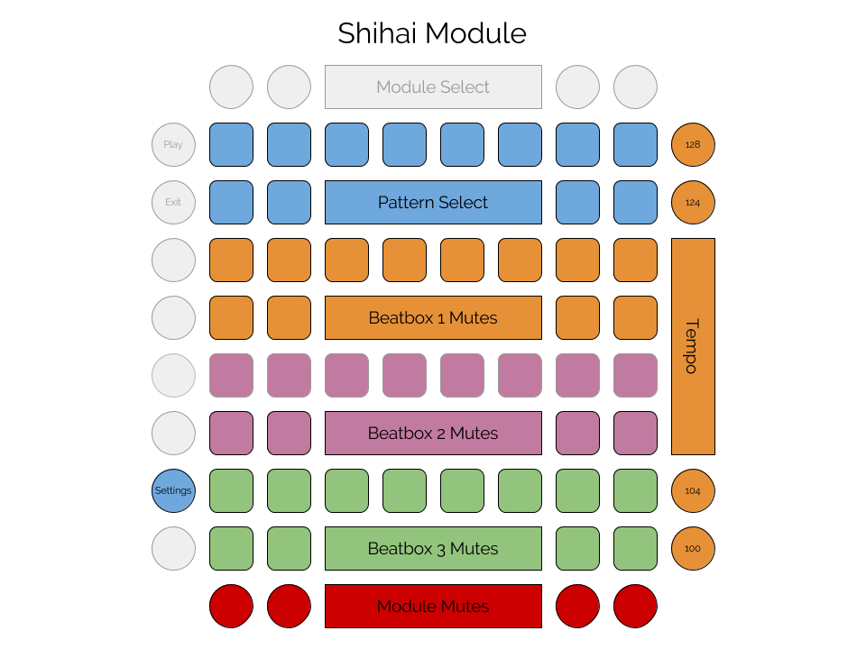
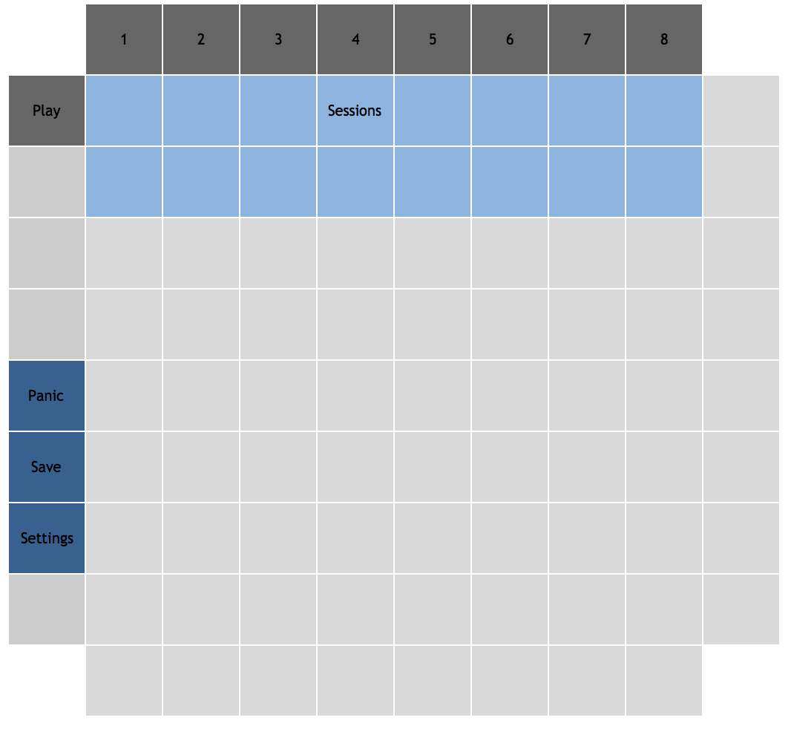

# Overview

"Shihai" means "control" in Japanese. The Shihai module is intended to control both Hachi itself and 
other modules. It can be used to set Hachi's clock tempo, mute/unmute other modules, 
select sessions and patterns (for modules that use sessions or patterns), 
set chords (for modules that use chords), 
and display a simple measure/beat clock. 

Modules in Hachi can support a number of capabilities. Shihai keeps track of these
and knows what it can tell the modules to do. These capabilities include:
- Save and load data. Shihai can tell these modules to save their current data.
- Play sessions and patterns. Shihai can tell these modules to load new sessions and patterns.
- Sync to a clock. Shihai can control the tempo of the clock that Hachi sends to these modules.


# Examples and Uses

- **Song transitions**. Organize your set so that, in each sequencer module, each session is a separate song. Transition to a new song by selecting the session in Shihai, forcing all sequencers to transition together.
- **Song sections**. Similarly, arrange the sections of songs to use the same pattern numbers in each sequencer, and use Shihai to load those patterns simultaneously.
- **Mix and arrange**. Use Shihai's module mutes and pattern controls to bring tracks in and out of the mix and select different beats. The measure clock can help time changes and transitions.


# Layout and Controls

## Main View



### Patterns

Shihai's 16 pattern pads can be used to select patterns from all modules that can load patterns.
For example, selecting pattern 3 in Shihai will cause all pattern modules to load pattern 3.
Pattern chains may also be selected by holding down the first pattern in the chain while
selecting the last pattern. Some individual modules (e.g. Step) will load the selected 
pattern immediately, while others will wait until the next measure.

### Clock Displays

Shihai's measure clock counts 8 measures at a time, and its step clock counts individual
sequencer steps. The clocks are display only.

### Tempo

The 8 buttons on the right are used to select Hachi's clock tempo. Tempo values start at
100 bpm at the bottom and increase by 4 with each button, to a maximum of 128 bpm.

### Module Mutes

These buttons can be used to mute the 8 modules loaded into Hachi. Positions correspond to
the module select buttons in the top row. Only muteable modules will be lit.

### Save

Pressing the save button will tell every module that can save data to save its 
current data to its current file, similar to pressing the save button on those
individual modules.


### Panic

Press this button to force every midi module to send "all notes off" on its channel.

### Settings

Toggle between the main view and the settings view.

## Settings View



### Sessions

As with the patterns controls, the sessions pads can be used to select a session from
all modules that can load sessions.


# Configuration

Shihai has no configuration options. 

```
  "modules": [
    {
      "class": "ShihaiModule"
    }
  ]
```

# Color Palette

Shihai has only one defined palette. 

- On most controls, dark blue indicates off/inactive, and pink indicates on/active.
- Sessions are light blue, with the current session highlighted white.
- Load and save files are green and red respectively, with the current file white.
- MIDI channel is blue, with the selected channel white.
- Muted modules are red, and active modules are white.
- Patterns are dark blue, with the current pattern white, and chained patterns gray.
- The measure clock is pink.
- The step clock is dim pink.

