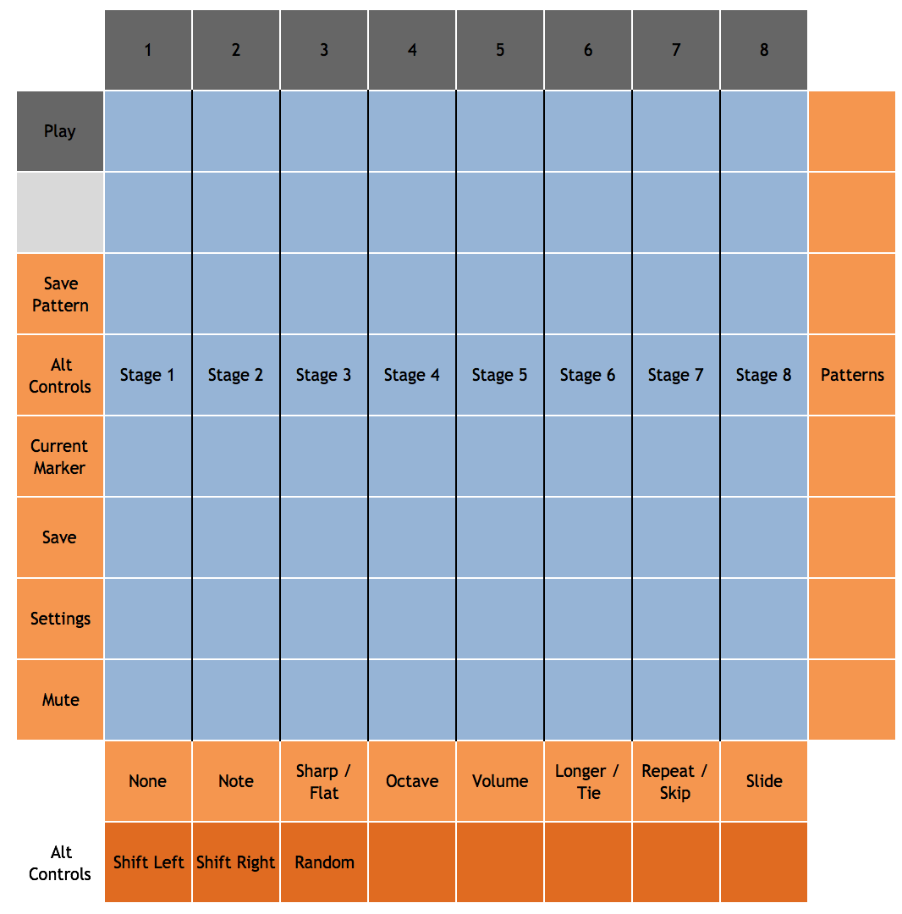

# Overview

Step is a monophonic sequencer inspired by analog and modular sequencers. 
The main goal was to have all controls for all steps available at once, with no 
special modes or key combinations. Step is well suited for improvisation
and experimentation.

Step can hold 16 sessions in memory at a time. Each session contains 8 patterns.
Each pattern consists of 8 stages. The entire contents of memory can be saved to
a file. Within the Step module, 8 different files can be saved and loaded, but
the files can be copied, backed up, and shared. Data is saved in a JSON format.


# Layout and Controls

## Main View



### Standard Controls

- Mute: disables the MIDI output of the sequencer.
- Settings: toggles between the main view and the settings view.
- Save: saves the current memory contents to the current file.


### Stages

Step consists of 8 "stages", each of which can play a note or a rest, or
tie the previous stage's note. Each stage can have a number of modifiers,
which affect how the stage is played. Each stage is represented by one column
of the pad grid. Notes and modifiers are all displayed in the column, denoted
by color. 

A note's position indicates which note (in an 8-note scale) should
be played, but other modifiers can be anywhere in the column and be in effect.
To add modifiers to a stage, select it in the modifier palette and then
tap any pad in the stage's column. 

The note of the currently playing column will be lit. By default, stages are
played from left to right. When the last stage is reached, the first is played 
again. A new measure will always reset Step to stage 1; if stages have been 
skipped, repeated, or made longer, this may lead to some interesting rhythms.

### Modifiers

The bottom row of buttons is the modifier palette. Tap one to select a
modifier; when you tap a pad in one of the stages, the modifier will be added
to the stage. Tap the pad again to remove the modifier. Multiple copies
of a modifier may be added to one stage; for example, a note can be played 
3 octaves up or repeated 5 times. The currently selected 
modifier will be shown via the color of the current marker button on the left.

Some modifiers are grouped in pairs. Tap the palette button to select 
the first, and tap it again for the second.

The available modifiers are:

- Note: indicates which note to play. By default, the note scale is C Major, though others are possible. Although it's possible to set more than one note modifier per stage, only one note is currently played. If no Note or Tie modifier is present, the stage becomes a rest.

- Sharp/Flat: raises (or lowers) the stage's note by a semitone.
- Octave Up/Down: raises (or lowers) the stage's note by an octave.
- Volume Up/Down: raises (or lowers) the volume (MIDI velocity) of the note.
- Longer/Tie. Longer increases the length of the stage's note by one clock tick (typically a 16th note). Tie causes the previous stage's note to be held for the length of the stage. When a Tie modifier is present, the Note modifier is ignored.
- Repeat/Skip. Repeat causes the stage to be repeated. Skip causes the stage to be skipped entirely. 
- Slide: plays the stage legato, by playing the stage's note before ending the previous note. This enables fingered portamento in sound modules that support it.

### Patterns

Each session contains 8 patterns, which are selected using the pattern buttons on the 
right. Tapping a pattern button will switch to that pattern immediately. To save the
current stage configuration as a pattern, hold down the pattern save button the left
and tap a pattern button.

### Alt Controls

The alt controls button on the left toggles between the modifier palette and the alternative editing controls. The available alt controls are:

- Shift left: shifts the stages to the left, with stage 1 becoming stage 8.
- Shift right: shifts the stages to the right.
- Random: toggles random play order. When random is on, stages will be played in random order rather than sequentially left-to-right.

## Settings View


### Sessions

Tap a session pad to select that session from memory. The current session is lit.

### Files

Tap a load pad to load the file with the corresponding number. For example,
if Step is configured to use "step" as a file prefix, pressing the first
pad will load "step-0.json" into memory. Similarly, tap a save pad to save 
the current memory to the corresponding file. The previous file will be moved
to a backup (but only the most recent backup will be retained). The most recently
saved or loaded file will be lit; this is the file that will be written when
tapping the save button in the main view.

### MIDI Channel

These 16 pads correspond to the 16 MIDI channels. Tap one to send the sequencer's
notes on that channel.


# Configuration

Step has no configuration options aside from a file prefix, used
to specify filenames for saving data. 

```
  "modules": [
    {
      "class": "StepModule",
      "filePrefix": "step0"
    }
  ]
```

# Color Palette

Step has only one defined palette. 

- On most controls, dark blue indicates off/inactive, and orange indicates on/active.
- Sessions are light blue, with the current session highlighted white.
- Load and save files are green and red respectively, with the current file white.
- MIDI channel is blue, with the selected channel white.
- Modifier colors are as follows:
  - Note: blue
  - Sharp: blue-green
  - Flat: dim blue-green
  - Octave Up: orange
  - Octave down: dim orange
  - Volume Up: green
  - Volume down: dim green
  - Longer: dark blue
  - Tie: purple
  - Repeat: pink
  - Skip: red
  - Slide: gray

